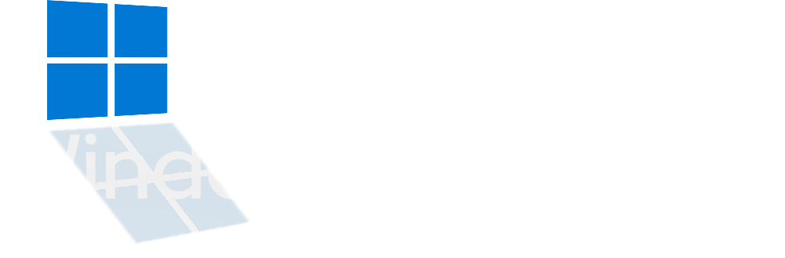

  

<h1 align="center">Enesehs's Windows Optimizer</h1>

  <strong>⚠️ Note: Enesehs's Windows Optimizer is currently in Open Beta. ⚠️</strong>
   
  Features may change, and occasional bugs might be present. Your feedback is valuable!

## Overview

Enesehs's Windows Optimizer is a lightweight, open-source batch tool designed to enhance the performance, clean up clutter, and apply useful tweaks to Windows operating systems. It aims to provide an easy way to keep your Windows system running smoothly and efficiently.

## Key Features

* **✨ User-Friendly Menu**: Simple, menu-driven interface for ease of use.
* **🧹 File Cleanup**: Quickly removes various temporary files (`%temp%`, `temp`, prefetch, etc.) to free up disk space.
* **🛠️ System Optimization**: Tools to check system health, repair files, and manage updates.
* **🚀 Performance & Tweaks**: Applies common Windows tweaks to potentially improve responsiveness and usability.
* **🛡️ Security Utilities**: Integrates basic checks using built-in Windows tools.

## Detailed Features

* **Disk Cleanup**: Cleans temporary files, prefetch files, and other unnecessary system clutter.
* **System Repair**: Runs System File Checker (`sfc /scannow`) to verify and repair protected Windows system files.
* **Windows Update Check**: Initiates a check for available Windows updates via standard system tools.
* **Antivirus Scan**: Starts a quick scan using the built-in Microsoft Defender Antivirus.
* **RAM Optimization**: Attempts to optimize system memory usage (Note: effectiveness can vary).
* **System Temperature Check**: Displays current CPU temperature using WMIC (may require appropriate hardware/drivers).
* **Disk Error Check**: Runs `chkdsk` to check the integrity of your HDD or SSD and potentially fix errors.
* **Windows Tweaks**:
    * Updates installed applications (requires clarification on method, e.g., uses winget?).
    * Network troubleshooting (e.g., Flush DNS, potentially other network reset commands).
    * Installs an Adblocker via DNS modification (specify which DNS if possible).
    * Fixes common MSI Installer errors (2502/2503).

## Requirements

* Windows Operating System (Specify versions, e.g., Windows 10, 11)
* Administrator Privileges (required to run the tool effectively)

## Installation

1.  **Download**: Get the latest version from the [Releases](https://github.com/enesehs/enesehs-windows-optimizer/releases) page.
2.  **Extract**: Unzip the downloaded file to a folder of your choice.

## Usage

1.  **Navigate**: Open the folder where you extracted the optimizer files.
2.  **Run as Administrator**: Right-click on `Enesehs's Windows Optimizer.bat` and select **Run as administrator**. This is crucial for most optimization tasks.
3.  **Select Options**: Use the on-screen menu to choose the optimization tasks you wish to perform.
4.  **Follow Prompts**: Read and follow any instructions or prompts displayed by the script.

## Troubleshooting

* **Permission Errors**: Ensure you are running the `.bat` file as an Administrator. Right-click -> "Run as administrator".
* **Unexpected Behavior**: As the tool is in beta, some functions might not work perfectly on all system configurations.
* **Reporting Issues**: If you encounter bugs or have problems, please report them on the [GitHub Issues](https://github.com/enesehs/enesehs-windows-optimizer/issues) page, providing as much detail as possible (Windows version, steps to reproduce, error messages).

## Contributing

Contributions are welcome! If you'd like to help improve the optimizer, please check the [Issues](https://github.com/enesehs/enesehs-windows-optimizer/issues) page or consider submitting a Pull Request. *
## Contact

* This project is in open beta. Feedback, suggestions, and bug reports are highly encouraged via GitHub Issues.
* For other inquiries, you can reach out to [enesehs@protonmail.com](mailto:enesehs@protonmail.com).

## License

*Enesehs's Windows Optimizer* is licensed under the [Eclipse Public License 2.0](https://www.eclipse.org/legal/epl-2.0/).
