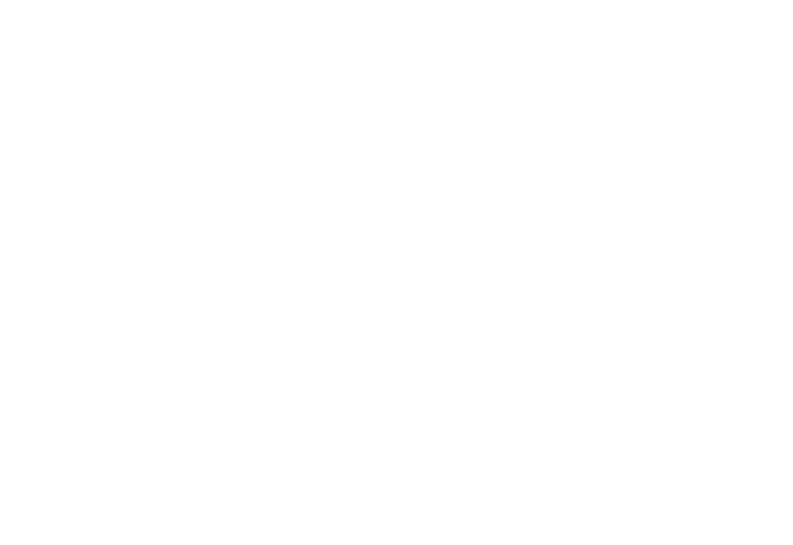
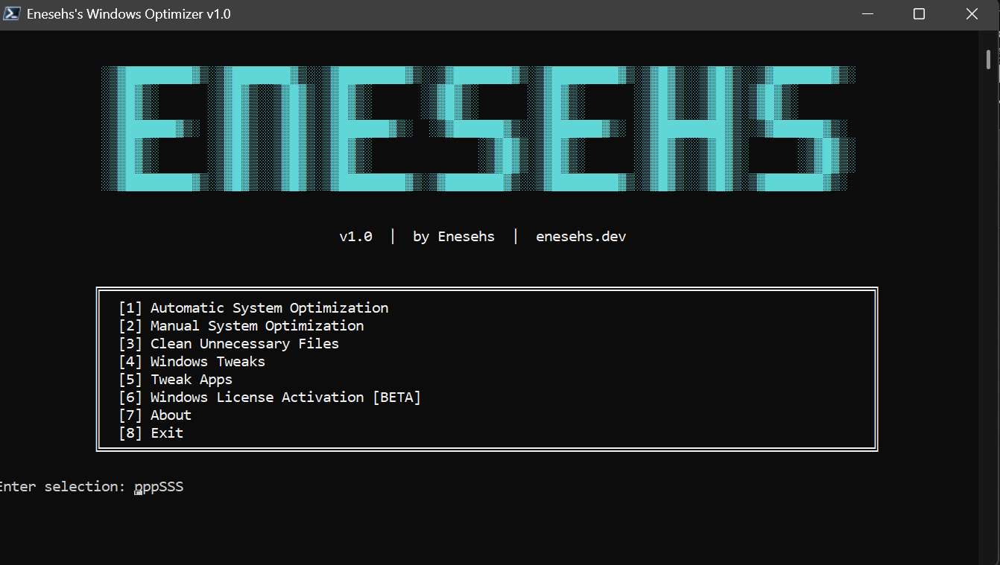
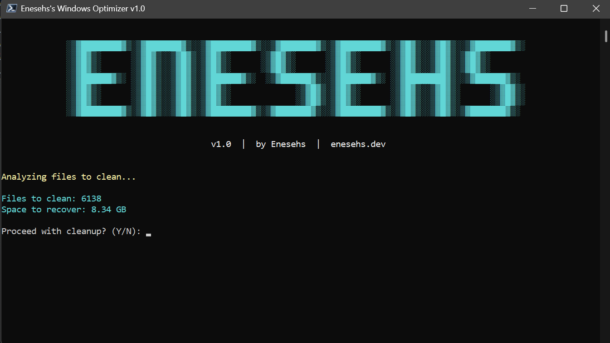

<p align="center">
  <picture>
    <source media="(prefers-color-scheme: dark)" srcset="path/white.svg" />
    <source media="(prefers-color-scheme: light)" srcset="path/dark.svg" />
    
  </picture>
</p>
<p align="center">
  <a href="https://github.com/enesehs/enesehs-windows-optimizer/releases"></a>
  <a href="https://github.com/enesehs/enesehs-windows-optimizer/releases"></a>
  <a href="https://github.com/enesehs/enesehs-windows-optimizer/stargazers"></a>
  <a href="https://github.com/enesehs/enesehs-windows-optimizer/blob/main/LICENSE"></a>
</p>
<p align="center">
  
  
</p>

<p align="center">
  A comprehensive PowerShell-based Windows optimization toolkit designed to enhance system performance, remove bloatware, apply privacy tweaks, and clean up unnecessary files.
</p>

---

## Screenshots

<p align="center">
  
  
</p>

---

## Quick Start

Run the following command in PowerShell as Administrator:

```powershell
irm enesehs.dev/win | iex
```

Or download manually from the [Releases](https://github.com/enesehs/enesehs-windows-optimizer/releases) page.

---

## Features

### System Optimization

| Feature | Description |
|---------|-------------|
| **Disk Cleanup** | Removes temporary files, Windows Update cache, crash dumps, prefetch files, and driver residues |
| **Disk Repair** | Scans and repairs disk errors using `chkdsk` and `Repair-Volume` |
| **System File Repair** | Runs SFC and DISM tools to repair corrupted Windows system files |
| **RAM Optimization** | Analyzes memory usage and launches Windows Memory Diagnostic |
| **Disk Health Check** | Reports physical disk health status using S.M.A.R.T. data |
| **Temperature Monitoring** | Displays CPU thermal zone temperatures |

### Performance Tweaks

| Feature | Description |
|---------|-------------|
| **Ultimate Performance** | Enables the hidden Ultimate Performance power plan |
| **Visual Effects Optimizer** | Disables animations and visual effects for better responsiveness |
| **Virtual Memory Optimizer** | Auto-configures pagefile size based on RAM |
| **Disk Optimization** | Runs TRIM for SSDs, Defragmentation for HDDs |
| **Services Optimizer** | Disables unnecessary services (Fax, Xbox, Remote Registry, etc.) |

### Gaming Optimizations

| Feature | Description |
|---------|-------------|
| **Gaming Mode** | Enables Windows Game Mode with optimized settings |
| **Mouse Acceleration** | Disables mouse acceleration for precise aiming |
| **Fullscreen Optimizations** | Disables FSO for better game compatibility |
| **Network Latency** | Disables Nagle's Algorithm and network throttling for lower ping |

### Privacy & Security

| Feature | Description |
|---------|-------------|
| **Telemetry** | Disables Windows telemetry and diagnostic data collection |
| **Cortana** | Disables Cortana assistant |
| **Activity History** | Disables activity tracking and timeline |
| **Advertising ID** | Disables personalized advertising |
| **Location Tracking** | Disables location services |
| **Typing Data** | Disables keyboard data collection |

### Bloatware Removal

Removes pre-installed Windows apps including:

- 3D Builder, Bing News, Bing Weather
- Solitaire Collection, People, Skype
- Xbox apps, Groove Music, Movies & TV
- Candy Crush Saga, Candy Crush Soda, Clipchamp
- Feedback Hub, Get Help, Tips

### Network Tools

| Feature | Description |
|---------|-------------|
| **Internet Repair** | Resets Winsock, IP stack, flushes DNS cache |
| **AdGuard DNS** | Configures ad-blocking DNS servers (94.140.14.14, 94.140.15.15) |
| **DNS Reset** | Removes custom DNS and reverts to DHCP |
| **TCP Optimization** | Optimizes TCP settings for lower latency |
| **LSO Disable** | Disables Large Send Offload to prevent packet issues |

### Windows Tweaks

| Feature | Description |
|---------|-------------|
| **Classic Context Menu** | Restores Windows 10 style right-click menu on Windows 11 |
| **Game DVR** | Disables Xbox Game Bar and DVR recording |
| **Search Indexing** | Disables Windows Search indexing service |
| **Event Logs** | Clears all Windows event logs |
| **MSI Installer Fix** | Fixes error 2502/2503 by resetting temp folder permissions |
| **Adobe Popup Blocker** | Blocks Adobe license verification popups via hosts file GenP |

### Utility Apps

Quick installation of recommended applications via winget:

- **NanaZip** - Modern file archiver
- **PowerToys** - Microsoft power user utilities
- **Everything** - Instant file search
- **EarTrumpet** - Per-app volume control
- **QuickLook** - Spacebar file preview
- **Flow Launcher** - App launcher
- And 15+ more productivity tools

### Windows Activation (Beta)

- Generic key installation based on Windows edition
- KMS activation support
- License backup and restore
- Activation period renewal

---

## Requirements

- **Operating System**: Windows 10 or Windows 11
- **PowerShell**: Version 5.1 or higher
- **Permissions**: Administrator privileges required
- **Internet**: Required for winget app installations and some features

---

## Installation Methods

### Method 1: One-Line Command (Recommended)

```powershell
irm enesehs.dev/win | iex
```

### Method 2: Manual Download

1. Download the latest `.ps1` file from [Releases](https://github.com/enesehs/enesehs-windows-optimizer/releases)
2. Right-click the file and select "Run with PowerShell"
3. If prompted, allow the script to run as Administrator

### Method 3: Clone Repository

```bash
git clone https://github.com/enesehs/enesehs-windows-optimizer.git
cd enesehs-windows-optimizer/releases
powershell -ExecutionPolicy Bypass -File "Enesehs-Windows-Optimizer-v1.0.ps1"
```

---

## Usage

1. Launch the optimizer using one of the installation methods above
2. The script will automatically request Administrator privileges if needed
3. Use the numbered menu to navigate between options:
   - **[1]** Automatic System Optimization - Runs all optimization tasks sequentially
   - **[2]** Manual System Optimization - Choose individual optimization tasks
   - **[3]** Clean Unnecessary Files - Remove temp files and driver residues
   - **[4]** Windows Tweaks - Access all tweaks and optimizations
   - **[5]** Tweak Apps - Install recommended utility applications
   - **[6]** Windows License Activation - Manage Windows activation
   - **[7]** About - View program information

---

## Safety

> ⚠️ **Warning:** Always create a backup before making system changes!

Before applying any system modifications, it is recommended to:

1. **Create a System Restore Point** (Option 1 in Windows Tweaks menu)
2. **Backup important data**
3. **Review the changes** before confirming

All operations are logged to `%USERPROFILE%\Enesehs's-Windows-Optimizer\` for troubleshooting.

---

## Troubleshooting

| Issue | Solution |
|-------|----------|
| Script won't run | Right-click PowerShell, select "Run as Administrator" |
| Execution policy error | Run `Set-ExecutionPolicy Bypass -Scope Process` first |
| Features not working | Ensure you have the latest Windows updates installed |
| Antivirus blocking | Add an exclusion for the script or disable real-time protection temporarily |

---

## Contributing

Contributions are welcome! Please:

1. Fork the repository
2. Create a feature branch (`git checkout -b feature/new-feature`)
3. Commit your changes (`git commit -m 'Add new feature'`)
4. Push to the branch (`git push origin feature/new-feature`)
5. Open a Pull Request

For bug reports and feature requests, please use the [Issues](https://github.com/enesehs/enesehs-windows-optimizer/issues) page.

---

## Contact

- **Email**: [enesehs@protonmail.com](mailto:enesehs@protonmail.com)
- **Website**: [enesehs.dev](https://enesehs.dev)
- **GitHub**: [github.com/enesehs](https://github.com/enesehs)

---

## License

This project is licensed under the [MIT License](LICENSE).

---

<p align="center">
  Made with by <a href="https://enesehs.dev"> enesehs</a> for you <3
</p>
